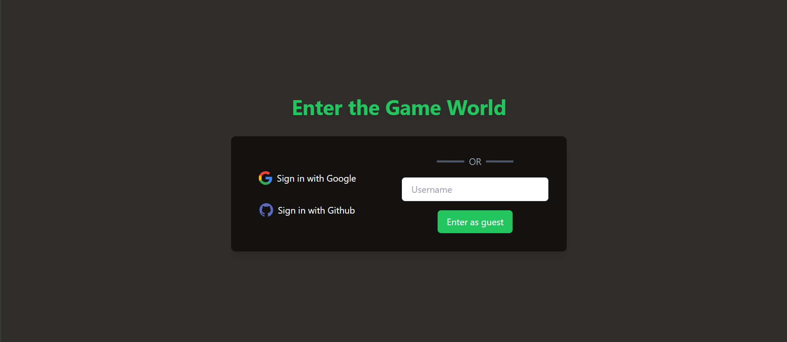
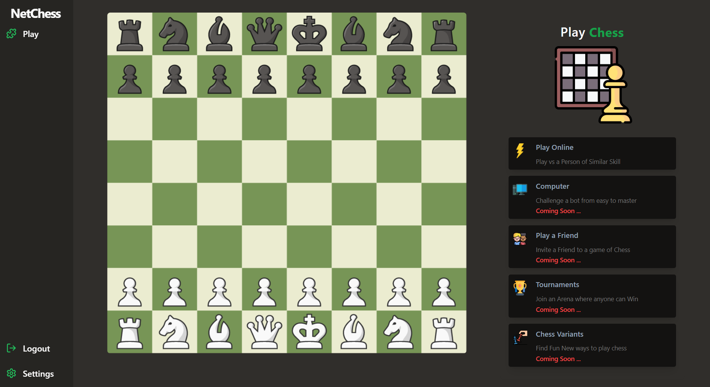
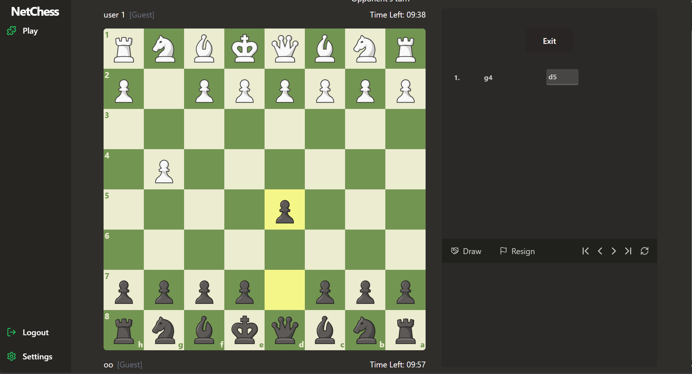

# Chess

## Glimpses

### Login Page  

### Home Page  

### Game Page  

## Overview

Building a platform where people can

1. Sign up  
2. Create a new match/get connected to an existing match  
3. During the match, let users play moves  
4. Have a rating system that goes up and down similar to standard chess rating  

## Tech Stack

1. React for Frontend  
2. Node.js for Backend  
3. Typescript as the language  
4. Separate Websocket servers for handling real time games  
5. Redis for storing all moves of a game in a queue  

## Setting it up locally

- Clone the repo  
- Copy over `.env.example` to `.env` everywhere  
- Update `.env` with  
  - Postgres DB Credentials  
  - Github/Google Auth credentials  
- Run `yarn install` at the root  
- Run `yarn build` at the root  
- To run backend and frontend concurrently, run `yarn dev` at the root  
- For websocket server  
  - `cd apps/ws`  
  - Run `yarn dev`  
- For DB migrations  
  - Run `npx prisma generate` inside `packages/db`  
  - Then run `npx prisma migrate dev` inside `packages/db`  
